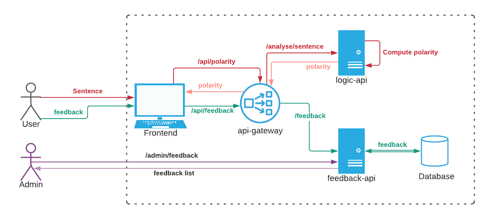

# Travail pratique GLO-4008/7008
Ce répértoire contient l'application ***Sentence Analyzer*** qui sert de point de départ pour le travail pratique du cours GLO-4008/7008: Applications infonuagique et DevOps.

## Description de l'application
***Sentence Analyzer*** est une application très simple exposant une interface web permettant l'entrée d'une phrase (*sentence*) dont la polarité (*Polarity*) est analysée pour détérminer si celle-ci a une tonalité positive ou négative.

La polarité est représentée par un nombre décimal dans l'intervalle [-1, 1].

Par exemple, I hate it étant une phrase à tonalité negative, retourne un score de -0.8. À l'inverse, la phrase I love it retourne un score de 0.5. 

Suite à l'obtention d'un score, il est possible à l'usagé de répondre une question de rétroactions pour savoir si le score attribué est correct ou non. Cette rétroaction est ensuite stockée dans une base de donnée pour permettre une amélioration continue du service.

De plus, il est possible à un administrateur d'obtenir la liste des rétroactions en communiquant directement avec le service `feedback-api`.

## Vue globale du système

## Description des services
| Service                       | Port                      |  Endpoints                    | Requests                  | Type | From          |
| -------------                 |-------------              | -----                         |-------                    |----|----           |
| [api-gateway](./api-gateway)   | 8080     | POST `/polarity`   POST `/feedback`   | `/analyse/sentence`   `/feedback` | POST   POST| [logic-api](/logic-api)     [feedback-api](/feedback-api)            |
| [logic-api](./logic-api)   | 5000     | POST  `/polarity`   | NA | NA | NA |
| [feedback-api](./feedback-api)   | 9000     | POST `/feedback`   GET `/feedback`   | Insert   Get all | query | Database (sqlite) |
| [frontend](./api-gateway)   | 80     | GET `/`   | `/api/polarity`   `/api/feedback` | POST   POST| [api-gateway](/api-gateway)            |

## Travail demandé
La tâche principale que vous aurez à effectuer est de définir les manifestes Kubernetes pour ce système. 

Voici une liste des ressources que vous devriez avoir pour un fonctionnement adéquat du système. Libre à vous de diverger de ces directives, tant que le fonctionnement est maintenu et que vous respectez les consignes spécifiées ci-bas. 30### api-gateway
#### Critères d'acceptation

- 2 Replicas
- LivenessProbe ***HTTP***
- Exposé à l'extérieur du cluster sous le prefix `/api` (***Note importante: Il vous est interdit de modifier le code de l'application directement, cela doit être fait au travers des ressources que vous offre Kubernetes***)

#### Ressources attendues

- Deployment
- service
- Ingress

### logic-api
#### Critères d'acceptation

- 2 Replicas
- LivenessProbe ***HTTP***

#### Ressources attendues

- Deployment
- service

### feedback-api
#### Critères d'acceptation

- 2 Replicas
- LivenessProbe ***HTTP***
- Admin path pour obtenir tous les feedbacks stockés (`/admin/feedback`)
- Persistance utilisant une base de donnée SQLite

#### Ressources attendues

- Deployment
- service
- Ingress
- PersistentVolumeClaim

### frontend
#### Critères d'acceptation

- 1 Replica
- Exposé à l'extérieur du cluster sous le prefix `/`

#### Ressources attendues

- Deployment
- service
- Ingress
